# 叠云 Agent 架构手册

> **产品名**：叠云 Agent（npm 包名 `dieyunagent` / `pixel-office-agent`）
> **文档类型**：架构说明 · 可打印版源稿
> **建议打印**：在浏览器中打开 [`ARCHITECTURE.print.html`](./ARCHITECTURE.print.html)，等待图表渲染完成后，选择 A4、双面、页边距「默认」或「窄」进行打印或导出 PDF。
> **关联文档**：[`DESIGN.md`](./DESIGN.md)（设计原理）· [`AGENT-STRATEGY.md`](./AGENT-STRATEGY.md)（Agent 策略分层 · 开放设计）· [`MEMORY.md`](./MEMORY.md)（记忆）· [`DEVELOPMENT.md`](./DEVELOPMENT.md)（开发发版）

---

## 目录

1. [概述](#1-概述)
2. [总体架构](#2-总体架构)
3. [进程与启动链](#3-进程与启动链)
4. [本地 Gateway](#4-本地-gateway)
5. [Agent 执行](#5-agent-执行)
6. [dieyun-core（Rust Sidecar）](#6-dieyun-corerust-sidecar)
7. [记忆系统](#7-记忆系统)
8. [渲染进程 UI 模块](#8-渲染进程-ui-模块)
9. [技能、MCP 与插件](#9-技能mcp-与插件)
10. [SSH 与远程工作空间](#10-ssh-与远程工作空间)
11. [浏览器自动化](#11-浏览器自动化)
12. [定时任务（Plans）](#12-定时任务plans)
13. [自动更新与打包](#14-自动更新与打包)
15. [代码库索引](#15-代码库索引)
16. [附录：目录速查与数据路径](#16-附录目录速查与数据路径)

---

## 1. 概述

叠云 Agent 是一个 **本地优先的桌面 AI Agent**：

- 用户在 Electron 窗口里对话；
- 模型可调用本机工具（读写文件、执行命令、查库、联网等）；
- 复杂任务走 **规划师 + 多子 Agent + Git Worktree 隔离**；
- 对话、技能、计划任务围绕同一套「模型设置 + Gateway」运转。

**一句话架构**：Electron 主进程负责「系统能力与安全边界 + Rust sidecar 编排」，渲染进程负责「Agent UI 与 Gateway 客户端」，本地 Gateway 用 WebSocket + RPC 桥接工具与记忆；复杂 Agent/Planner 循环在 **`dieyun-core`（Rust）**，LLM 与工具执行由 **Node 主进程** 委托。

### 1.1 核心设计取舍

| 话题 | 选择 | 原因 |
|------|------|------|
| Gateway 协议 | 自研 WebSocket RPC | 轻量、与 Electron 解耦 |
| 智能主路径 | 渲染进程 UI + Main/Rust 循环 | UI 迭代快；状态机在 Rust |
| 路径安全 | 白名单 | 用户选工作空间即授权 |
| 复杂任务 | Planner + worktree | 并行与隔离 |
| 简单任务 | 单 Agent Rust loop | 省规划延迟 |
| 记忆存储 | Rust SQLite（唯一写入路径） | 一致性与性能 |
| 定时任务 | 单次 LLM，无工具循环 | 可预测、低成本 |

### 1.2 安全模型

- `contextIsolation: true`，`nodeIntegration: false`——页面 JS 不能直接 `require`。
- 特权操作必须经 **preload IPC** 或 **Gateway RPC**。
- Gateway 只监听 **127.0.0.1**，带 **token 鉴权**。
- 文件/命令能力靠 **路径白名单 + 权限开关**。

---

## 2. 总体架构

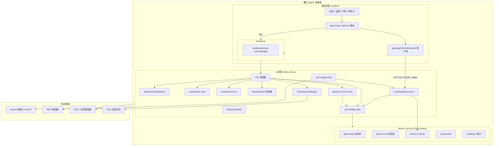

### 2.1 三层职责

| 层 | 目录 | 职责 |
|----|------|------|
| **Renderer** | `src/renderer/` | 聊天气泡、输入、Plan 进度、Gateway 客户端、工具 UI 委托 |
| **Main** | `src/main-entry.js`、`src/agent/` | 窗口/托盘、IPC、Worktree、LLM HTTP、Rust 桥、计划调度 |
| **Gateway** | `src/gateway/` | 工具 RPC、权限、路径白名单、桥接 Rust memory |
| **Rust** | `crates/dieyun-core/` | Agent/Planner 状态机、SQLite 记忆、压缩、索引 |

---

## 3. 进程与启动链

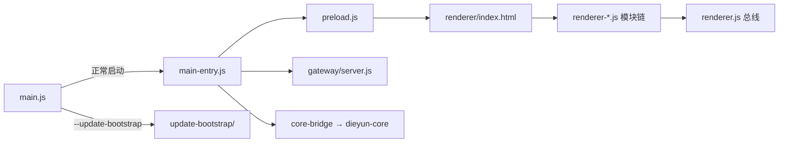

| 文件 | 作用 |
|------|------|
| `src/main.js` | 极薄路由：正常应用或更新引导 |
| `src/main-entry.js` | Electron 应用主体：窗口、托盘、IPC、Gateway、更新、计划 |
| `src/preload.js` | `contextBridge` 暴露 `window.diecloud` |
| `src/renderer/index.html` | UI 壳，按序加载各 renderer 模块 |
| `src/renderer/renderer.js` | UI 总线与 Gateway 客户端入口 |

### 3.1 Rust 能力开关（环境变量）

| 变量 | 含义 |
|------|------|
| `DIEYUN_CORE=0` | 禁用 sidecar（Agent/Plan 不可用） |
| `DIEYUN_CORE_BIN` | 开发时指定 debug 二进制路径 |

---

## 4. 本地 Gateway

实现：`src/gateway/server.js` + `src/gateway/rpc.js`

### 4.1 连接协议（v1）

1. WebSocket 连接 `127.0.0.1:17330`（可用 `DIECLOUD_GATEWAY_PORT` 改端口）。
2. 首包 `{ type: 'auth', token }`，token 存于 `%APPDATA%/pixel-office-agent/gateway-token.txt`。
3. 之后 `{ type: 'call', id, method, params }` → `{ type: 'result', id, ok, data|error }`。

渲染进程封装：`gatewayCall(method, params)`（`renderer-gateway.js`）。

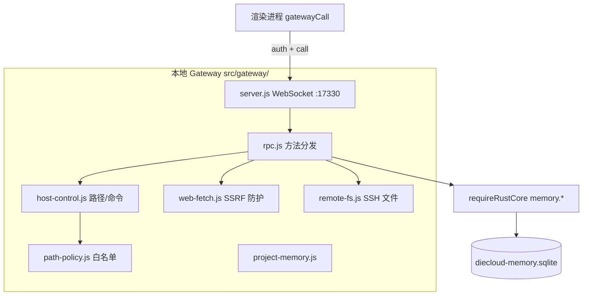

### 4.2 RPC 命名空间

| 前缀 | 职责 |
|------|------|
| `permissions.*` | 读/写/执行/SQL/联网开关 |
| `memory.*` | 会话、消息、长期记忆、每会话工作空间 |
| `compaction.*` | 上下文 token 估算与压缩 |
| `fs.*` | 白名单内读写列目录 |
| `host.*` | Shell、打开 URL |
| `web.*` | HTTP fetch、搜索（SSRF 防护） |
| `sql.*` | 可选 SQL Server 只读查询 |

### 4.3 工作空间（两层，勿混）

1. **Gateway 全局 `workspaceRoot`**（`userData/workspace.json`）——决定 `fs_*` / `host_exec` 的默认 cwd。
2. **每会话 `workspace_path`**（SQLite `sessions` 表）——切换历史对话时 `applySessionWorkspace()` 写回 Gateway。

**读根**：gateway-readable、userData、`~/.dieyun`、技能目录、工作空间等。
**写根**：更窄——gateway-readable、`~/.dieyun/skills`、当前工作空间。

---

## 5. Agent 执行

入口：`renderer-agent-loop.js` 的 `runAgentCompletion()`。

> 发送前 `taskTier` 只走结构信号（路径/选区/@Codebase），护栏数字在 `agent-limits`。详见 [AGENT-STRATEGY.md](./AGENT-STRATEGY.md)。

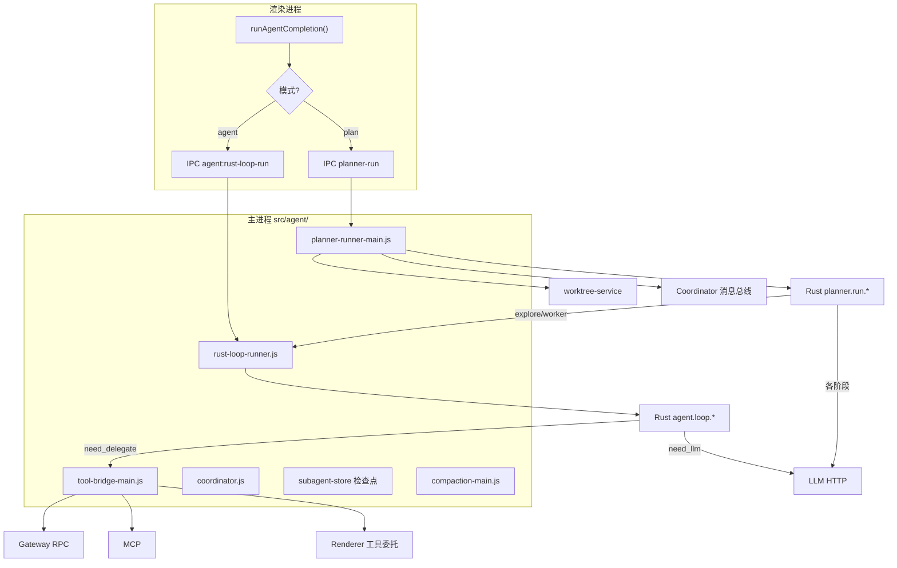

### 5.1 单 Agent 工具循环（时序）

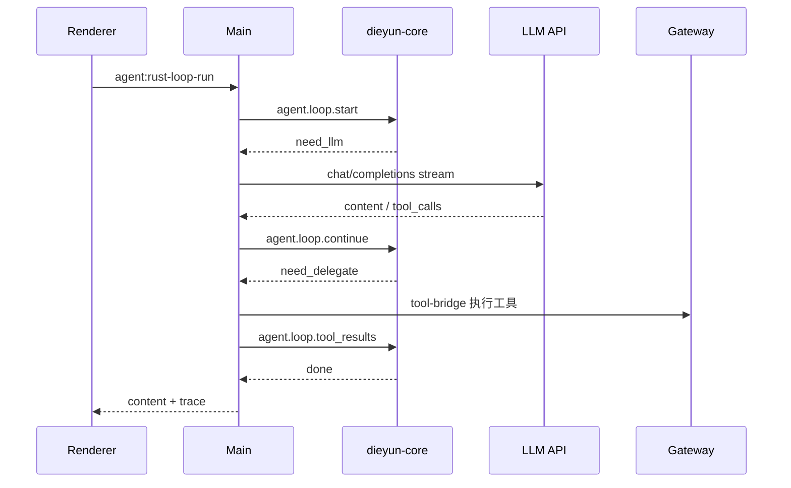

要点：

- Rust **只负责循环状态机**；**LLM HTTP 在 Main**。
- 工具全部 `need_delegate` → `tool-bridge-main.js`。
- 压缩：`compaction-main.js` 在每轮 LLM 前可压缩 messages。
- 无 silent 回退 JS loop；sidecar 不可用则报错。

### 5.2 Planner 编排

触发：`getComposerAgentMode() === 'plan'`，或可恢复检查点。

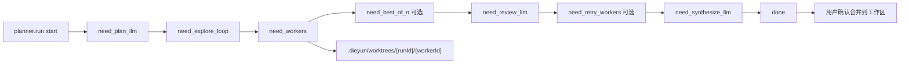

| 阶段 | agentType | 工具集 | 目的 |
|------|-----------|--------|------|
| Explore | explore | 只读 fs / 搜索 | 摸清代码库 |
| Shell | shell | 命令执行 | 构建、脚本 |
| Build | build | 读写 fs + 执行 | 改代码 |

**Worker 隔离**：Git 仓库下每个 Worker 在独立 worktree + 分支（`src/git/worktree-service.js`）。
**检查点**：`~/.dieyun/agent-checkpoints/{runId}.json`。
**后台运行**：`sessionActiveRuns` 允许切换会话后原 Agent 继续跑。

### 5.3 主进程协调器

`src/agent/coordinator.js`：run / task 队列、超时、取消、消息总线。
Planner 子 Agent 通过 coordinator 按 `toRole` 投递（`message-bus.js`）。

---

## 6. dieyun-core（Rust Sidecar）

`crates/dieyun-core`，经 `src/core-bridge.js` **stdio 行 JSON-RPC** 通信。

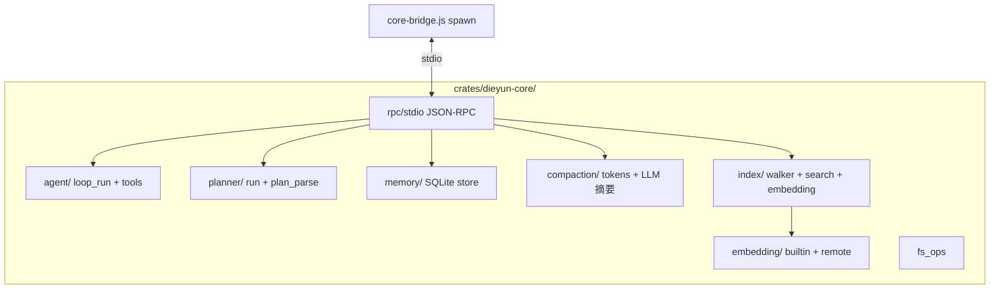

| RPC 前缀 | 职责 |
|----------|------|
| `agent.loop.*` | 单 Agent 工具循环状态机 |
| `agent.ping` | 能力探测 |
| `planner.run.*` | Planner 编排状态机 |
| `memory.*` | SQLite 会话/消息/长期记忆/向量 |
| `compaction.*` | token 预算、原子块折叠、摘要 |
| `codebase.*` | 工作区索引与语义搜索 |

打包：`npm run pack:dieyun-core` → `build/dieyun-core/dieyun-core.exe`。

---

## 7. 记忆系统

存储：`crates/dieyun-core/src/memory/` → `%APPDATA%/pixel-office-agent/diecloud-memory.sqlite`（WAL）。

**唯一写入路径**：Gateway `requireRustCore('memory.*')`；sidecar 未就绪则 RPC 抛 `RUST_CORE_UNAVAILABLE`。

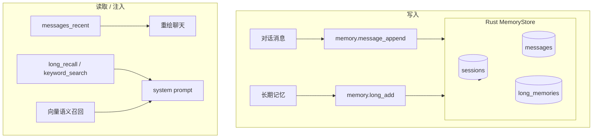

### 7.1 表结构（逻辑）

| 表 | 用途 |
|----|------|
| `sessions` | 会话元数据：title、archived、workspace_path |
| `messages` | 短期对话：user / assistant / system |
| `long_memories` | 长期笔记式记忆 |

### 7.2 会话生命周期

- 当前会话 ID：`localStorage` `diecloud.active.session.v1`。
- 列表：`memory.sessions_list`（有消息的会话才显示）。
- 切换会话：拉 `messages_recent` 重绘 + 恢复工作空间与滚动位置。

详见 [`MEMORY.md`](./MEMORY.md)。

---

## 8. 渲染进程 UI 模块

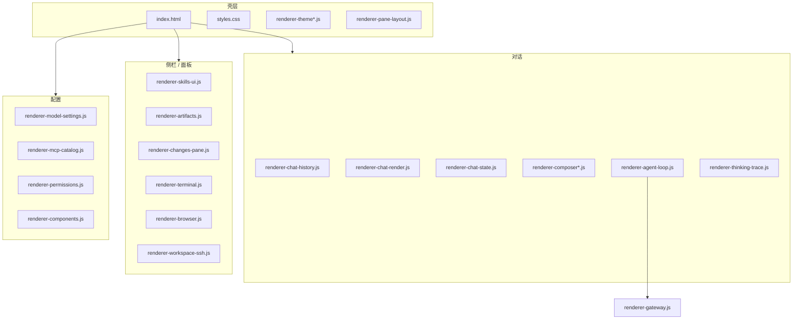

### 8.1 脚本加载顺序（节选）

1. `renderer-context-engine.js` — 上下文拼装
2. `renderer-agent-api.js` / `renderer-agent-loop.js` — Agent IPC 入口
3. `renderer-chat-render.js` / `renderer-chat-history.js` — 聊天渲染与会话
4. `renderer.js` — UI 总线

---

## 9. 技能、MCP 与插件

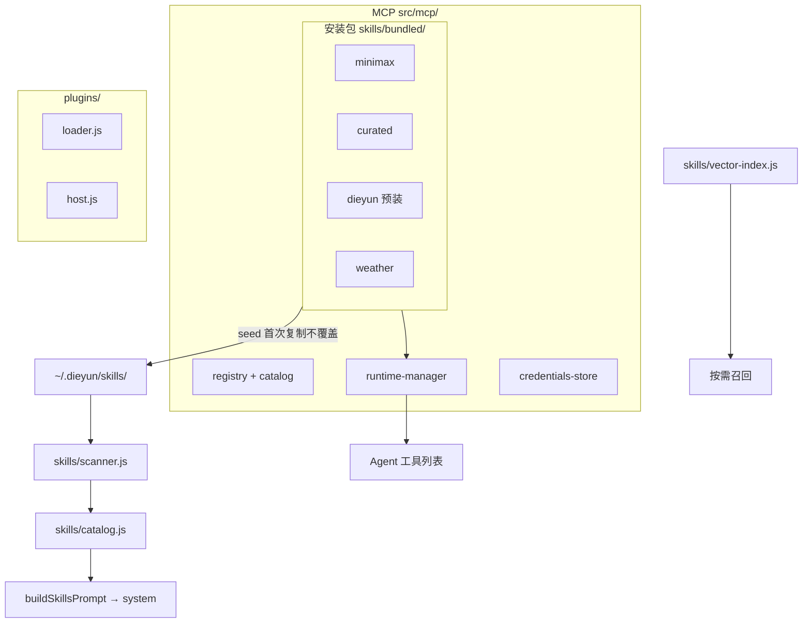

- **Bundled**：随安装包（`extraResources`）。
- **Seed**：`seed-to-dieyun.js` 复制到用户目录，已存在不覆盖。
- **启用状态**：`localStorage` `diecloud.skills.enabled.v1` 等。
- **技能本质**：主要是 system prompt 知识；部分解锁工具（如天气）。
- **预装 MCP**：`src/mcp/registry.js`；`bundledServer`（如 `dieyun-open-api`）随 asar 打包，用 `ELECTRON_RUN_AS_NODE` 启动，密钥走环境变量。

---

## 10. SSH 与远程工作空间

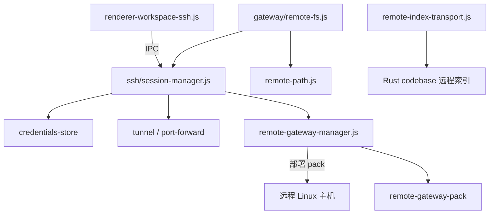

远程路径约束在 `ssh/remote-path.js`；工作空间 URI 形如 `ssh://user@host/path`。

---

## 11. 浏览器自动化

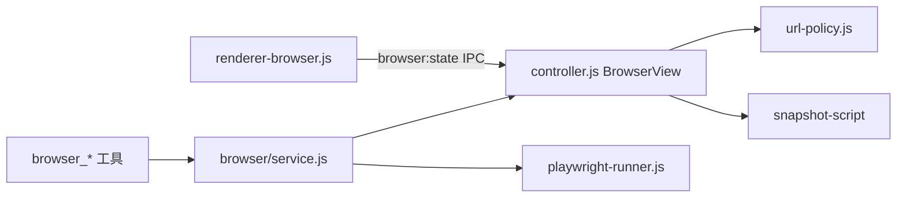

内嵌 `BrowserView`，仅允许 http/https；快照与点击坐标脚本在 `browser/snapshot-script.js`。

---

## 12. 定时任务（Plans）

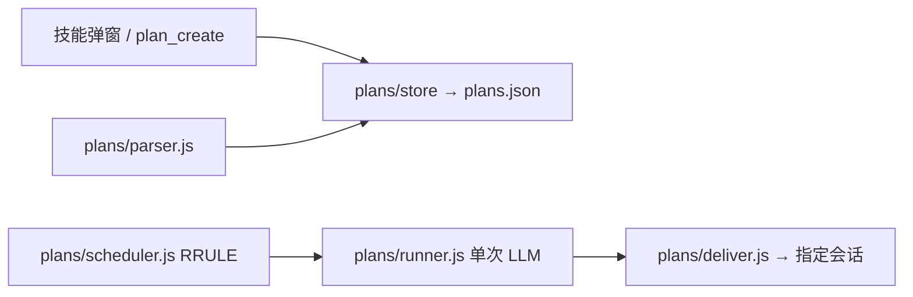

| 对比 | 对话 Agent | 定时任务 Plans |
|------|------------|----------------|
| 入口 | 主聊天 | 技能弹窗 / 工具 |
| 执行 | 多轮工具循环 | **单次** LLM |
| 存储 | SQLite messages | `userData/plans.json` |
| 投递 | 当场显示 | 写入 `deliver.sessionId` 会话 |

---

## 14. 自动更新与打包

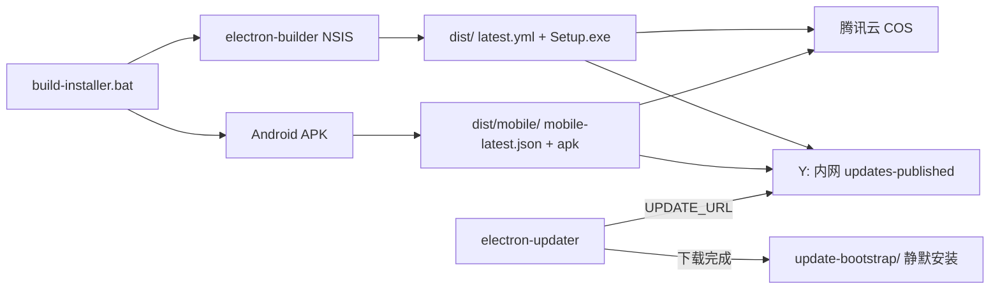

| 步骤 | 命令 / 路径 |
|------|-------------|
| 一键打包发布 | `build-installer.bat`（输入版本号，构建 PC + 手机，发布 Y: + COS） |
| 仅 PC 打包 | `npm run build:nsis` |
| 仅内网发布 | `scripts\publish-updates-to-y.bat` |
| 仅 COS 上传 | `node scripts\upload-updates-cos.mjs` |
| 可选资源上传 | `npm run upload:optional-cos` |
| 默认更新 URL | `http://192.168.31.62:3099/`（`main-entry.js`） |

---

## 15. 代码库索引

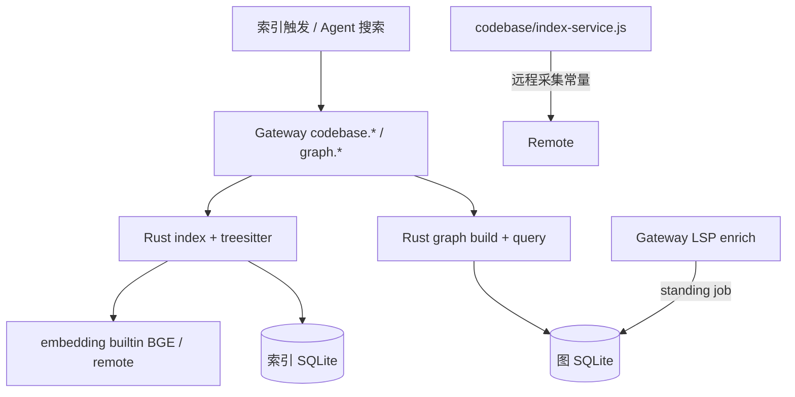

### 15.1 Codebase 文本索引

- `codebase.*` 仅 Rust 实现；Node 侧 `index-service.js` 保留远程采集辅助。
- 切块优先 **Tree-sitter**（JS/TS/Python/Go/Rust 按函数/类边界）；失败回退行窗（`CHUNK_LINES` / overlap）。
- 单仓库文件上限 **16000**；`codebase.search` 结果上限 **48**。
- 向量检索：≤2500 条精确余弦；更大库走 **FTS 候选重打分 + 分层模量采样**（`embedding/ann.rs`），不依赖 sqlite-vec / 原生 HNSW 扩展。

### 15.2 代码图谱

- 构建：`graph.index` / `graph.index.start`，AST 抽取符号、import、call（与 codebase 同语言范围）。
- 查询：`graph.symbols`、`graph.callers` / `callees`、`graph.repo_map`（枢纽文件/符号 + markdown 摘要）。
- Agent 准备上下文时注入「仓库结构图」；后台可 kick `graph.lsp_enrich`（冷却约 10 分钟）用 LSP 补全 callers。
- 符号向量检索与 codebase 共用 ANN 分层策略；单次语义结果上限 **80**。

---

## 16. 附录：目录速查与数据路径

### 16.1 源码目录

| 路径 | 内容 |
|------|------|
| `src/main-entry.js` | 主进程中枢 |
| `src/gateway/` | 本地 RPC 服务 |
| `src/agent/` | Agent / Planner / 工具桥 / 压缩 |
| `src/renderer/` | 全部 UI 模块 |
| `crates/dieyun-core/` | Rust sidecar |
| `skills/bundled/` | 预装技能 |
| `src/ssh/` | 远程 SSH 工作空间 |
| `src/plans/` | 定时任务 |
| `src/browser/` | 内嵌浏览器自动化 |
| `src/update-bootstrap/` | 更新安装引导 |
| `src/mcp/` | MCP 运行时 |
| `src/plugins/` | 插件宿主 |
| `src/lsp/` | 语言服务诊断 |
| `src/git/worktree-service.js` | Planner Worker 隔离 |

### 16.2 运行时数据路径

| 路径 | 内容 |
|------|------|
| `%APPDATA%/pixel-office-agent/` | userData：Gateway DB、权限、workspace、plans、更新 token |
| `~/.dieyun/` | skills、memory 笔记、默认 workspace、dieyun.md、checkpoints |
| `~/.dieyun/workspace/` | 未选工作空间时的默认可写目录 |
| `dist/` | 打包输出 |
| `Y:\client-electron\updates-published` | 内网更新静态文件 |

---

*文档版本：与仓库 `package.json` 同步维护 · 生成目的：A4 打印成册*
