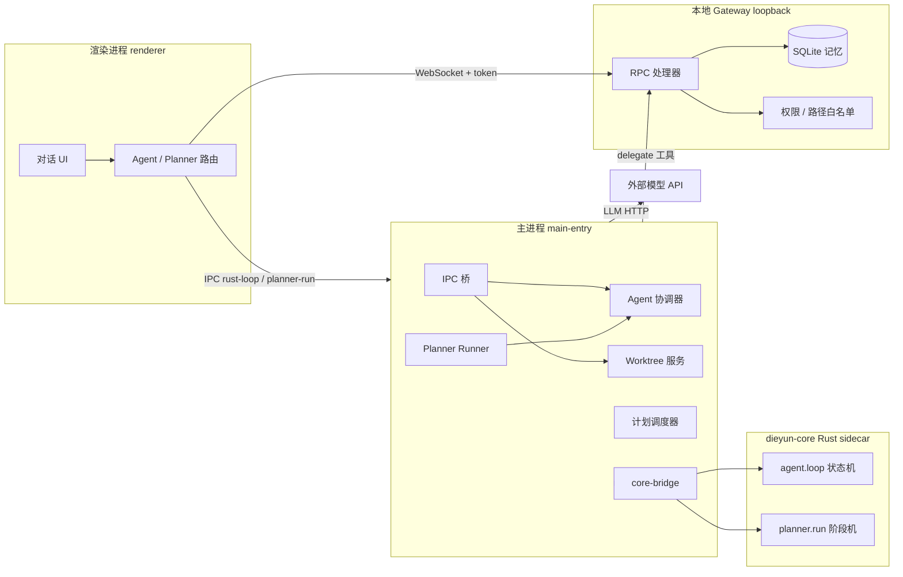
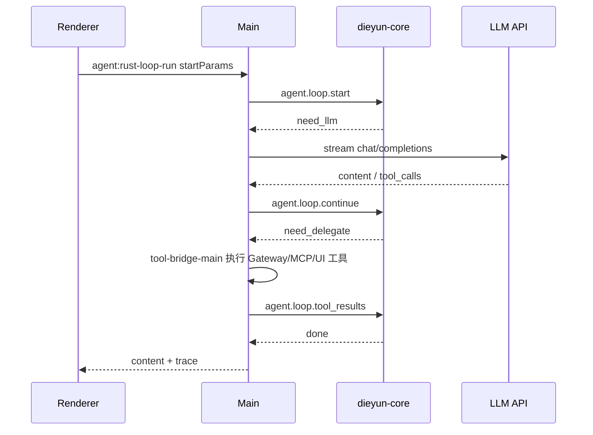
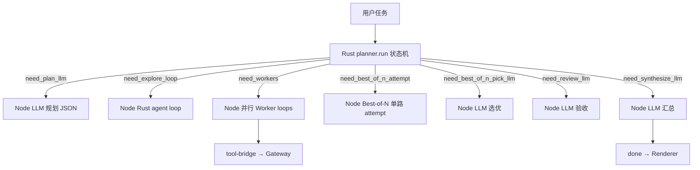
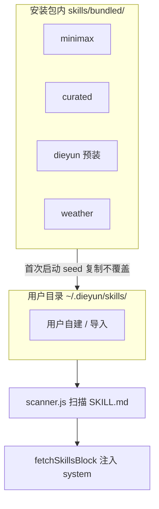

# 叠云 Agent 设计逻辑与原理

> 产品名：**叠云 Agent**（npm 包名 `pixel-office-agent`）
> 本文档记录「为什么这样设计」与核心原理，便于长期维护时快速回忆。
> 操作类说明见 [DEVELOPMENT.md](./DEVELOPMENT.md)。
> Agent 策略分层（开放设计，待实现）见 [AGENT-STRATEGY.md](./AGENT-STRATEGY.md)。

---

## 1. 我们在做什么

叠云 Agent 是一个 **本地优先的桌面 AI Agent**：

- 用户在 Electron 窗口里对话；
- 模型可以调用本机工具（读写信件、执行命令、查库、联网等）；
- 复杂任务走 **规划师 + 多子 Agent + Git Worktree 隔离**；
- 对话、技能、计划任务等围绕同一套「模型设置 + Gateway」运转。

**一句话架构**：Electron 主进程负责「系统能力与安全边界 + Rust sidecar 编排」，渲染进程负责「Agent UI 与 Gateway 客户端」，本地 Gateway 用 WebSocket + RPC 把工具与记忆桥接起来；复杂 Agent/Planner 循环逐步迁入 **`dieyun-core`（Rust）+ Main 进程 LLM/工具委托**。



---

## 2. 入口与进程分工

### 2.1 启动链

| 文件                         | 作用                                                   |
| -------------------------- | ---------------------------------------------------- |
| `src/main.js`              | 极薄路由：`--update-bootstrap` 走安装引导，否则加载 `main-entry.js` |
| `src/main-entry.js`        | 真正的 Electron 应用：窗口、托盘、IPC、Gateway 启动、更新、计划     |
| `src/preload.js`           | `contextBridge` 暴露 `window.diecloud`，渲染进程唯一特权 API    |
| `src/renderer/index.html`  | UI 壳；按顺序加载 compaction → planner（`../agent/`）→ agent-loop 模块 → `renderer.js` |
| `src/renderer/renderer.js` | UI + Gateway 客户端；Agent 发送逻辑在 `renderer-agent-loop.js` 等模块 |

### 2.2 为什么智能放在渲染进程（及正在迁移的部分）

历史与 pragmatic 选择：

- **模型调用**走 `fetch` 直连用户配置的 OpenAI 兼容端点，不必把 API Key 再绕一圈主进程；
- **工具循环**需要频繁更新 DOM（思考过程、工具 trace），UI 更新仍主要在渲染进程；
- **主进程**专注：子进程生命周期、Git worktree、文件对话框、单实例、自动更新。

**Rust 迁移（R5–R7，已完成）**：Agent 与 Planner **均依赖 dieyun-core**；JS 编排与 Legacy loop 已移除。

| 能力 | 要求 | 实现 |
| --- | --- | --- |
| 单 Agent 工具循环 | `rustCore.enabled` | Main → Rust `agent.loop.*` + Node LLM + delegate 工具桥 |
| Plan 模式 | `rustCore.planner` | Main → Rust `planner.run.*` 状态机 + Node 执行 LLM/loop/worktree |
| 工具实际执行 | 始终 | `tool-bridge-main.js` → Gateway / MCP / UI |

环境变量（`gateway:get-info` → `rustCore`）：

- `DIEYUN_CORE=0`：禁用 sidecar（Agent/Plan 均不可用）。
- 改 Rust 后：`npm run pack:dieyun-core`；开发测试可设 `DIEYUN_CORE_BIN=target/debug/dieyun-core.exe`。

### 2.3 安全模型（要牢记）

- `contextIsolation: true`，`nodeIntegration: false`——页面 JS 不能直接 `require`。
- 所有特权操作必须经 **preload IPC** 或 **Gateway RPC**。
- Gateway 只监听 **127.0.0.1**，带 **token 鉴权**——信任模型是「本机已登录用户」，不是多租户沙箱。
- 文件/命令能力靠 **路径白名单 + 权限开关**，不是容器级隔离。

---

## 3. 本地 Gateway 原理

实现：`src/gateway/server.js` + `src/gateway/rpc.js`

### 3.1 连接协议（v1）

1. 客户端 WebSocket 连 `127.0.0.1:17330`（可用环境变量 `DIECLOUD_GATEWAY_PORT` 改端口）。
2. 首包发送 `{ type: 'auth', token }`，token 存在 `%APPDATA%/pixel-office-agent/gateway-token.txt`。
3. 之后 `{ type: 'call', id, method, params }` → `{ type: 'result', id, ok, data|error }`。

渲染进程封装：`gatewayCall(method, params)`（`renderer.js`）。

### 3.2 RPC 命名空间

| 前缀              | 职责                             |
| --------------- | ------------------------------ |
| `permissions.*` | 读/写本机能力开关（读文件、写文件、执行命令、SQL、联网） |
| `memory.*`      | 会话、消息、长期记忆、**每会话工作空间**（**仅 Rust**；sidecar 不可用则 RPC 报错） |
| `compaction.*`  | 上下文 token 估算 / prepare / apply / **maybe_compact**（含 LLM 摘要，Rust HTTP） |
| `fs.*`          | 白名单内读写列目录                      |
| `host.*`        | Shell、打开 URL、打印图片              |
| `web.*`         | HTTP fetch、搜索引擎（带 SSRF 防护）     |
| `sql.*`         | 可选 SQL Server 只读查询             |

### 3.3 工作空间与路径白名单

**两层概念，不要混：**

1. **Gateway 全局 `workspaceRoot`**（`userData/workspace.json`）

   - 决定 `fs_*` / `host_exec` 的默认 cwd 和可写根之一。
   - IPC：`workspace:get` / `workspace:set`。

2. **每会话 `workspace_path`**（SQLite `sessions` 表，v1.3.68+）

   - 切换历史对话时，渲染进程 `applySessionWorkspace()` 把该会话绑定的路径写回 Gateway 全局。
   - 用户点文件夹图标选路径时，`setCurrentWorkspace()` 同时更新 Gateway + 当前会话记录。

**读根**（`_collectReadRoots`）：gateway-readable、userData、`~/.dieyun`、技能目录、默认 workspace（`~/.dieyun/workspace`）、用户主目录、系统临时目录、当前与并行会话工作空间、开发态额外根。

**写根**（`_collectWritableRoots`）：gateway-readable、`~/.dieyun/skills`、默认 workspace、用户主目录、系统临时目录、当前与并行会话工作空间。

**远程根**（`src/ssh/remote-path.js` `remoteAllowedRoots`）：远程工作空间根 + `<远程 HOME>` + `/tmp`；HOME 由 ssh 层连接时探测并缓存（`session-manager.getHomeDir`），供同步的路径判定使用。

> **⚠ 完全放开路径限制**（设置页「本机权限 · 完全放开路径限制」，落盘于 `permissions.unrestrictedPaths`，**默认关闭**）：
> 开启后本地读/写根 = 本机所有卷根（Windows 枚举盘符）、远程根 = `/`，等于不再做路径校验。
> 白名单组装点仍只有两处：`gateway/server.js` 与 `ssh/remote-path.js`，其它模块只消费，勿再复制判定。

相对路径解析：`src/gateway/host-control.js` 的 `normalizeFilePathInput()`，基于 `defaultCwd`。

> **原理**：用户选的工作空间 = 主动扩大 Agent 可写范围；未选时用 `~/.dieyun/workspace` 作为默认落盘处。
> 默认 workspace / 主目录 / 临时目录恒定可用，避免「工作空间权限不足时无处落脚」。

---

## 4. Agent 执行原理

入口：`renderer-agent-loop.js` 的 `runAgentCompletion()`，按模式与环境变量分支。

### 4.1 路径 A：单 Agent 工具循环

**唯一路径** — `chatCompletionWithToolsViaRust()` → IPC `agent:rust-loop-run`（Legacy JS `chatCompletionWithTools` 已移除）：



要点：

- Rust **只负责循环状态机**（轮次、tool_calls 配对、delegate 调度）；**LLM HTTP 仍在 Node**（Main）。
- **工具执行**（R6）：loop 内无 native 工具入口，全部 `need_delegate` → `src/agent/tool-bridge-main.js`。次数上限由宿主传入 `agent-limits` `ctxAgentToolCallLimit`（或模型设置 `agentToolCallLimit`）。
- **流式**：Main 经 IPC `agent:rust-loop-phase` 推送 delta，Renderer 更新思考 UI。
- **压缩**：Main 侧 `compaction-main.js` 在每轮 LLM 前可压缩 messages，并可选归档到 `memory.compaction_archive`。
- 开启 Rust 后 **不再** silent 回退 JS loop；IPC 不可用则报错。

### 4.2 路径 B：规划师编排（Planner）

触发：`getComposerAgentMode() === 'plan'`，或存在可恢复检查点。

**Rust 驱动**（`crates/dieyun-core/src/planner/` + `src/agent/rust-planner-runner.js`）：

| RPC | 作用 |
| --- | --- |
| `planner.run.start` | 创建 run，返回 `need_plan_llm` 等首阶段 |
| `planner.run.continue` | 提交 LLM/loop/worker 结果，推进状态机 |
| `planner.run.worker_loop` | 生成 Worker 子任务 agent loop 的 messages |
| `planner.run.cancel` | 取消 |

Node（Main）只做：**LLM HTTP**、**Rust agent loop**（Explore/Worker）、**worktree/coordinator**、**仲裁 UI IPC**。



阶段：`need_plan_llm` → `need_explore_loop`（可选）→ `need_workers` → `need_best_of_n_attempt` / `need_best_of_n_pick_llm`（可选，build 子任务）→ `need_review_llm` → `need_retry_workers`（可选）→ `need_synthesize_llm` → `done`。

**已删除**：`src/agent/planner-orchestrator.js`（JS 编排）；Plan 模式 **无 Renderer 回退**。

**阶段说明：**

| 阶段      | agentType | 工具集         | 目的         |
| ------- | --------- | ----------- | ---------- |
| Explore | `explore` | 只读 fs / 搜索等 | 先摸清代码库，再动手 |
| Shell   | `shell`   | 偏命令执行       | 跑脚本、构建     |
| Build   | `build`   | 读写 fs + 执行  | 改代码、写文件    |

**Worker 隔离**：若工作空间是 Git 仓库，每个 Worker 在
`{repo}/.dieyun/worktrees/{runId}/{workerId}` 独立 worktree + 分支
（`src/git/worktree-service.js`）。相对路径在 Worker 内会改写到 worktree 根。

**Best-of-N**（可选）：Rust 编排 `need_best_of_n_attempt` → `need_best_of_n_pick_llm`；Node 创建 `{worker}-bn{N}` worktree 并跑 agent loop，LLM 选优后写入 results。用户配置来自 `localStorage` `dieyun.planner.bestOfN.v1`（2 或 3，仅含 build 子任务的 worker 生效）。

**变更合并**：运行结束不自动 `git merge`，而是 `previewRunWorktreeChanges` → UI 让用户确认应用到工作区（`handleWorktreeApplyAfterRun`）。若用户切走了会话，用 `pendingWorktreeApply` 延后弹窗。

**检查点**：`~/.dieyun/agent-checkpoints/{runId}.json`（`src/agent/subagent-store.js`），可恢复 Planner 流水线状态。

**仲裁（Rust Planner 路径）**：Main 经 `agent:planner-arbitrate` 请求 Renderer 弹窗 → `agent:planner-arbitrate-result` 回传决策 → `agentCoordinator.arbitrate()`。

### 4.3 主进程协调器与 Rust sidecar

**协调器** — `src/agent/coordinator.js`：内存中的 run / task 队列、超时、取消、结构化消息总线。

- IPC：`agent:run-start/cancel/end`、`task-enqueue`、`message-post`、`messages-for-role`…
- Planner 里子 Agent **不直接互相说话**，而是通过 coordinator 按 `toRole` 投递（`src/agent/message-bus.js`）。
- Rust Planner 路径下，`planner-main-bridge.js` 在 Main 内直接调用 coordinator，不再绕 Renderer IPC。

**dieyun-core** — `crates/dieyun-core`，经 `src/core-bridge.js` stdio JSON-RPC 通信：

| RPC 前缀 | 职责 |
| --- | --- |
| `agent.loop.*` | 单 Agent 工具循环状态机 |
| `agent.ping` | 能力探测（`delegateOnly: true`） |
| `planner.run.*` | Planner 编排状态机（plan / explore / workers / review / synthesize） |
| `codebase.*` / `fs.*` | 索引与文件（loop 不直接执行工具；读写走 Gateway） |
| `memory.*` | SQLite 会话/消息/长期记忆/压缩归档；embedding 写入与语义召回 |
| `compaction.*` | 上下文 token 估算、原子折叠 prepare、LLM 摘要后 apply |

**并行与互斥**：

- 同一轮多个 **只读** 工具可并行；
- **会改文件/执行命令** 的工具在 Planner 多 Worker 场景下走 `runExclusiveAgentTool` 队列，减少 worktree 冲突。

### 4.4 后台运行

`sessionActiveRuns`：用户切换到别的历史对话时，原会话 Agent 仍在跑；回到该会话时恢复占位气泡与 trace。

---

## 5. 记忆系统

> 详细分层、读写时机与注入规则见 **[MEMORY.md](./MEMORY.md)**。

存储：`crates/dieyun-core/src/memory/`（Rust `MemoryStore`）→ `%APPDATA%/pixel-office-agent/diecloud-memory.sqlite`（WAL）。**唯一写入路径**：Gateway `requireRustCore('memory.*')`；sidecar 未就绪时 RPC 直接抛 `RUST_CORE_UNAVAILABLE`（JS `memory-store.js` 已删除）。

**Rust memory RPC**（完整）：`memory.ping`、`touch_session`、`sessions_list`、`session_*`、`message_append`、`messages_recent/clear/delete_turn`、`long_add/recent/recall/keyword_search/reindex/vector_status/status_set/decay`、`consolidation_job_*`、`compaction_archive/recent`、`sessions_with_messages`、`messages_after`、`long_memories_after`；`agent.run_upsert`、`plan_save`、`steps_save`、`state_get`、`trace_save/get`。

**代码库索引**：`codebase.*` 全部由 Rust 实现（含远程采集）。

### 5.1 表结构（逻辑）

| 表               | 用途                                        |
| --------------- | ----------------------------------------- |
| `sessions`      | 会话元数据：`title`、`archived`、`workspace_path` |
| `messages`      | 短期对话：`user` / `assistant` / `system`      |
| `long_memories` | 长期笔记式记忆（带来源字段）                            |

### 5.2 会话生命周期

- 当前会话 ID 存 `localStorage`：`diecloud.active.session.v1`。
- 列表：`memory.sessions_list`（仅有消息的会话才出现在侧边栏）。
- 首条用户消息自动提炼标题（截取首行，最多 48 字）。
- **切换会话**：拉 `memory.messages_recent` 重绘聊天 + `applySessionWorkspace` 恢复工作空间。

## 6. 上下文压缩

文件：`src/agent/compaction-main.js`（Main 进程，IPC `compaction:maybe-compact`）；Renderer 经 preload 调用 Main，**无本地 LLM 回退**。

**Rust 分工**（`crates/dieyun-core/src/compaction/`）：`compaction.estimate` / `prepare` / `apply` 负责 token 预算、tool-call 原子块折叠与 messages 重组；`compaction.maybe_compact` 在 sidecar 内通过 `reqwest` 调用 chat API 做 LLM 摘要（`core.configure` 传入 `llm.baseUrl/apiKey/textModel`）。

**Renderer 路径**：`applyContextCompaction()` → IPC `compaction:maybe-compact`（与 Rust agent loop 同逻辑）；sidecar 不可用则报错。上下文圆环 token 经 `compaction:estimate-tokens`（Rust）；IPC 不可用时本地启发式仅用于 UI。`compaction:reset-state` 经 preload 暴露。

**为什么需要**：工具多轮后 `messages` 膨胀，会撞模型上下文上限。

**原理**：

- 在工具循环中，当消息条数或轮次达到阈值，调用压缩 Agent（也是 LLM）把 **中间历史** 摘要成一条 system 说明；
- **工具调用配对**（`assistant.tool_calls` + `tool` 结果）作为原子块，避免打断导致模型懵掉；
- 压缩是 **有损的**——重要细节应靠长期记忆或让用户写入文件。

### 6.1 LSP 诊断注入（规划 · 先于 Monaco）

**目标**：发消息前把语言服务诊断（行号、TS/pyright 代码）注入 system prompt，减少 Agent 盲目读文件。
**实现**：主进程 `src/lsp/` 管理 language server；Gateway `workspace.diagnostics`；渲染进程 `fetchWorkspaceDiagnosticsContext` 并入 Fast path / 代码类 Agent。
**UI**：本阶段 **无** Monaco / Problems 面板；Monaco 后续复用同一 DiagnosticsService。

详见 **[LSP-DIAGNOSTICS.md](./LSP-DIAGNOSTICS.md)**。

---

## 7. 技能（Skills）

### 7.1 三个层次



- **Bundled**：随安装包发布（`extraResources` + `asarUnpack`）。
- **Seed**：`seed-to-dieyun.js` 启动时复制到 `~/.dieyun/skills/{category}/`，**已存在的不覆盖**（保护用户改过的技能）。
- **扫描**：`scanner.js` 读 `SKILL.md` frontmatter，生成 `builtin:category:name` 形式 ID。

### 7.2 启用状态

存在渲染进程 `localStorage`：

- `diecloud.skills.enabled.v1` / `diecloud.skills.hidden.v1`
- 默认启用：`builtin:weather` 及 `builtin:minimax:`、`builtin:curated:` 前缀——系统 prompt 会变大，这是产品默认策略。

### 7.3 与工具的关系

技能主要是 **system prompt 知识**，引导 Agent 使用通用工具（如 `web_fetch`）完成任务；不再为单个技能内置专用工具（天气等已改为 skill + Open-Meteo + `web_fetch`）。
Agent 也可用 `skill_create` IPC 在用户目录新建技能。

---

## 8. 产物面板（v1.3.68+）

标题栏 **产物** 按钮：在主聊天右侧展开 **内嵌双栏**，不是全屏弹窗。

| 区域   | 行为                                        |
| ---- | ----------------------------------------- |
| 文件列表 | `fs.list_dir` 列当前会话工作空间；`..` 返回上级；目录可点击进入 |
| 内容预览 | 点击文件 `fs.read_file`，`<pre>` 展示，可选中复制      |

- 列表与预览、对话与产物区之间均有 **可拖拽分隔条**，宽度存 `localStorage`。
- 本会话 `fs_write_file` 写入的路径会有 **蓝点** 标记（`sessionArtifacts`），便于找刚生成的文件。

---

## 9. 定时任务（Plans）

**注意：定时任务与对话 Agent 共用会话与运行态，但不是同一次运行。**

| 对比  | 对话 Agent        | 定时任务 Plans                                    |
| --- | --------------- | --------------------------------------------- |
| 入口  | 主聊天             | 技能弹窗 → 定时任务 / `plan_create` 工具                |
| 执行  | 多轮工具循环（Renderer 发起） | 多轮工具循环（**Main 调度器发起**，`plans/plan-agent-runner.js`）；core 不可用时降级为单次 LLM（`plans/runner.js`） |
| 存储  | SQLite messages | `userData/plans.json`（RRULE / onceAt）+ 计划专用会话  |
| 投递  | 当场显示            | **运行时**即写入计划专用会话（`plan-run-turn.js`，同 `deliver.sessionId`） |

**设计原因**：计划任务要可预测、可停止、少副作用；复杂自动化应让用户明确指定会话与技能子集。

调度：`plans/scheduler.js` + 主进程定时器；解析自然语言创建计划：`plans/parser.js`。

### 9.1 运行态如何进入 UI

计划运行由 Main 发起，Renderer 拿不到 `agent:rust-loop-phase`，历史上表现为「后台跑、要刷新才看到」。
现在的链路（三处，缺一不可）：

```
Main 运行边界：plan-run-turn.beginPlanRunTurn（建会话 + 写 user 轮次）
  → Main IPC `plans:phase` run_start（AgentRunEvent）
  → Renderer `renderer-automation.js` 登记进 sessionActiveRuns
  → Rust agent loop phase
  → src/plans/plan-run-events.js（归约成 Rust 风格 trace + 流式正文）
  → Main IPC `plans:phase`（trace / done / error / stopped）
  → 复用聊天链路：流式气泡 / 历史「后台运行中」小环 / Composer 停止按钮
```

- 停止：`plans:cancel` 让 Main abort 当前这次运行（`AbortController` 透传到 Rust loop）；
  用户停止不写入 `lastRunOk`，也不覆盖上一次的真实结论。
- `plans:list` 会合并内存运行态（`running` / `runId` / `runningSessionId`），
  窗口中途刷新也能显示「运行中」。
- Main 只产出事实（thought / tools / streamContent），summary 与 argsBrief 由 Renderer 统一生成。

### 9.2 运行边界的会话与轮次落库（`plans/plan-run-turn.js`）

计划运行不经过 Renderer 的聊天发送链路，会话轮次只能由 Main 写；这一份落库逻辑收敛在
`src/plans/plan-run-turn.js` 单一来源（降级路径 `plans/deliver.js` 复用同一份文案与 meta）：

| 时机 | 动作 | 原因 |
| ---- | ---- | ---- |
| `run_start` **之前** | `beginPlanRunTurn`：`ensurePlanSession` → `memory.message_append`(user) → `memory.touch_session` | `memory.sessions_list` 只返回**有消息**的会话；先写这一轮，Renderer 首拍（`RUN_START`）就能刷新出该会话与「运行中」，而不是等跑完才第一次出现 |
| 终态事件 **之前** | `endPlanRunTurn`：`memory.message_append`(assistant，meta 含 `traceRunId` = 本次 runId) | 收尾时 Renderer 会重载该会话消息；消息先在库里，重载才能立刻看到这一轮。停止/失败也写一条，避免只剩悬空用户轮次 |
| 运行边界**落盘** | `plansStore.beginRun`：写 `runState`（runId / sessionId / startedAt） | 用户轮次落库之后落盘；此后无论进程怎么死，下次启动都能从这条标记知道「哪条用户轮次还没有回复」 |
| 收尾**之后** | `plansStore.endRun`：清 `runState` | 收尾已经发生，不需要恢复。残留只可能来自「进程被杀」—— 那时这段代码根本不会执行 |

- `traceRunId` 是思考区与气泡的挂钩：Renderer 收尾按 runId 存 trace（`persistPlanRunTrace` →
  `saveAssistantTraceRecord`，并置 `live.traceCheckpointClosed`），该消息下次打开时靠
  `meta.traceRunId` 把思考区挂回来；同时避免遗留 `status=running` 的 checkpoint 被当成「可恢复中断任务」。
- 顺序不可颠倒：先 `endPlanRunTurn` 再 `flushTrace` 再广播终态，否则最后一轮进度会被终态事件吃掉。
- 终态事件带上**同一份正文**（`assistantReplyText(result)` 只算一次，落库与 `streamContent` 共用）：
  气泡收尾收成什么，与重载会话后看到的消息完全一致；模型不流式正文时也不会只剩思考区。
- 对应地，`run-events.applyAgentRunEventToLive` 规定：**终态事件（done/error/stopped）不带正文时不清空
  已流式渲染的正文**（`createAgentRunEvent` 会把缺省 `streamContent` 规整成 `''`，照抄会把气泡抹空）。
- Renderer 侧 `bindPlanRunSession` / `showPlanSessionTurnIfOpen` 只做 UI 登记与「用户正停在该会话时先 load 出这一轮」，
  不参与落库。

### 9.3 运行边界的崩溃恢复（`mcp-plans-boot#recoverInterruptedRuns`）

`try/finally` 只能覆盖「Main 还在跑」的失败。进程被杀 / 应用重启时收尾代码不会执行，
会话里会留下一条**永远没有回复的用户轮次**（界面永久停在悬空消息上）。

因此运行边界是**持久化**的（`plans.json` 的 `runState`），启动时由 Main 补写中断回执：

| 环节 | 行为 |
| ---- | ---- |
| 启动 | `bootPlansRuntime` 调 `recoverInterruptedRuns`：对每条残留 `runState`，在 `sessionId` 上写一条 `interruptedRunResult` 的中断回执（`assistantReplyText` 的 `interrupted` 分支），再 `endRun` |
| 幂等 | 不重跑计划（重跑会让用户看到两次执行）；回执写失败时**保留** `runState`，下次启动重试，避免把未回复的轮次永久留在会话里 |
| 会话失联 | `ensurePlanSession` 发现绑定会话已删除时重建，并把 `rebuilt` / `staleSessionId` 上抛；Main 记 warn 日志，不再静默把报告写进一条用户没在看的会话 |
| 终态送达 | Renderer `finishPlanLiveRun`：只有 live 登记**确实属于本次计划**时才 `dispatchAgentRunEvent`（否则会串台）；无论有没有拿到登记，只要用户正停在该会话就**以库为准重载一次** —— 正文由 Main 落库，重载才是唯一无条件的兜底 |
| 落库不挡 UI | trace 落库（`persistPlanRunTrace`）只等 1.5s 上限：`saveAssistantTraceRecord` 不 settle 时也必须收尾，否则气泡永远停在 loading、正文永不出现 |

- `runState` 不是表单字段：`PlansStore#upsert` 在 patch 未显式携带 `runState` 时保留原值，
  避免用户在运行期间保存计划把边界标记清掉。
- 中断回执不写 `traceRunId`：那次运行的 trace 已随进程丢失，挂上去只会留下空思考区。

## 11. 自动更新与打包

### 11.1 版本号

对外发布时用根目录 `build-installer.bat` 输入版本号。脚本会同步更新 PC `package.json` / `package-lock.json` 与手机端 `gradle.properties`，保证桌面端和手机端发布版本一致。

### 11.2 构建

```bash
build-installer.bat   # PC + 手机打包，并发布到 Y: 与腾讯 COS
npm run build:nsis    # 仅 PC 安装包：dist/dieyunagent-Setup-x.y.z.exe + latest.yml + blockmap
```

客户端默认 `UPDATE_URL`：`http://192.168.31.62:3099/`（`main-entry.js`）。
### 11.3 安装体验

下载完成后 `launchUpdateBootstrap()` 启独立引导进程静默跑 NSIS，避免主窗口卡死。

---

## 12. 关键设计取舍（防忘）

| 话题                     | 选择                                 | 原因 / 代价                       |
| ---------------------- | ---------------------------------- | ----------------------------- |
| Gateway 协议             | 自研 WebSocket RPC                   | 轻量、与 Electron 解耦；非 gRPC/HTTP2 |
| 智能在渲染进程                | 是                                  | UI 与 LLM 迭代快；`renderer.js` 臃肿 |
| 路径安全                   | 白名单                                | 实现简单；用户选工作空间即授权               |
| 复杂任务                   | Planner + worktree                 | 并行与隔离；编排 JS + Explore/Worker Rust loop；非 git 目录则降级无隔离 |
| 简单任务                   | 单 Agent                            | 省规划师延迟与 JSON 解析失败风险           |
| Agent 循环实现             | Rust sidecar 唯一路径              | 主任务状态机在 dieyun-core；Renderer 仅 IPC 与进度展示 |
| Planner JSON           | 多轮重试 + fallback                    | 现实里模型常输出脏 JSON                |
| 工具轮次上限                 | 实质上无硬顶                             | 靠停止按钮 + 压缩；长跑需用户自觉            |
| 技能默认全开 minimax/curated | 是                                  | 能力强但 prompt 大、费 token         |
| 定时任务                   | 与对话同一套 Agent 循环（Main 发起 + 实时回 UI）     | 结果可复现；core 不可用时降级单次 LLM        |
| 会话工作空间                 | 每会话 SQLite 字段                      | 历史对话互不污染 cwd                  |
| 单实例                    | `requestSingleInstanceLock` + 命名管道 | Windows 多开兜底                  |
| 关窗口                    | 隐藏到托盘                              | 后台 Gateway / 计划继续跑             |

---

## 13. 数据目录速查

| 路径                                     | 内容                                                                 |
| -------------------------------------- | ------------------------------------------------------------------ |
| `%APPDATA%/pixel-office-agent/`        | Electron userData：Gateway DB、权限、workspace.json、plans、更新 token |
| `~/.dieyun/`                           | Agent 用户数据根：skills、memory 笔记、默认 workspace、dieyun.md、checkpoints    |
| `~/.dieyun/workspace/`                 | 未选工作空间时的默认可写目录                                                     |
| `skills/bundled/`（仓库内）                 | 安装包自带技能源                                                           |
| `dist/`                                | 打包输出                                                               |
| `Y:\client-electron\updates-published` | 内网更新静态文件发布位                                                        |

---

## 14. 渲染进程脚本加载顺序

`index.html` 中 Agent 相关（节选）：

1. `renderer-context-engine.js` — 上下文拼装与本地 token 启发式
2. `renderer-agent-api.js` / `renderer-agent-loop.js` — Rust loop / Planner IPC 入口；压缩与 token 估算走 Main IPC
3. `renderer.js` — 其余 UI 与 Gateway 客户端

改 Planner 看 `crates/dieyun-core/src/planner/` 与 `src/agent/rust-planner-runner.js`。改单 Agent loop 看 `crates/dieyun-core/src/agent/` 与 `src/agent/rust-loop-runner.js`。

---

## 15. 已知架构张力（未来若要演进）

这些是代码里已暴露、尚未彻底解决的点，记下来避免重复争论：

1. **工具并行度**：单 Agent 路径已并行只读工具；Planner 写工具仍偏保守。
2. **流式最终答案**：思考过程流式，最终 assistant 正文有时仍等整包 JSON。
3. **Planner 触发**：Composer Plan 模式 vs Agent 模式。
4. **renderer 单体**：Agent/Planner 编排已在 Rust+Main；UI 与 Gateway 客户端仍集中。
5. **检查点恢复**：Planner 检查点由 Node 写入（`~/.dieyun/agent-checkpoints/`），Rust `resumeCheckpoint` 跳过已完成子任务并保留 `results`；RPC 测试见 `test-rust-planner-pipeline`。
6. **DEVELOPMENT.md 部分段落过时**：以代码与本文为准。

---

## 16. 相关文件索引

```
src/main.js
src/main-entry.js
src/preload.js
src/core-bridge.js
src/agent-home.js
crates/dieyun-core/          # Rust sidecar：agent.loop、planner.run、codebase.index、memory.*、compaction.*、embedding
src/gateway/server.js
src/gateway/rpc.js
crates/dieyun-core/src/memory/  # SQLite MemoryStore
src/gateway/host-control.js
src/gateway/web-fetch.js
src/agent/rust-loop-runner.js
src/agent/tool-bridge-main.js
src/agent/rust-planner-runner.js
src/agent/planner-runner-main.js
src/agent/planner-main-bridge.js
src/agent/planner-tool-filters.js
src/agent/compaction-main.js
src/agent/coordinator.js
src/agent/subagent-store.js
src/agent/task-schema.js
src/renderer/renderer.js
src/renderer/renderer-agent-loop.js
src/renderer/renderer-agent-api.js
src/renderer/renderer-agent-api.js
src/agent/compaction-main.js
src/git/worktree-service.js
src/skills/scanner.js
src/skills/seed-to-dieyun.js
src/plans/store.js
src/plans/scheduler.js
src/plans/runner.js
package.json
```

**测试（Rust 相关）**：

```bash
npm run pack:dieyun-core
npm run test:rust-agent-loop
npm run test:rust-planner-pipeline
npm run test:rust-planner-smoke
npm run test:tool-bridge-delegate
```

---

*文档版本：与 **v0.0.14+ 记忆/压缩/索引硬 Rust** 对齐（`dieyun-core` 为 SQLite 与 compaction LLM 唯一路径，无 JS MemoryStore 回退）。*
