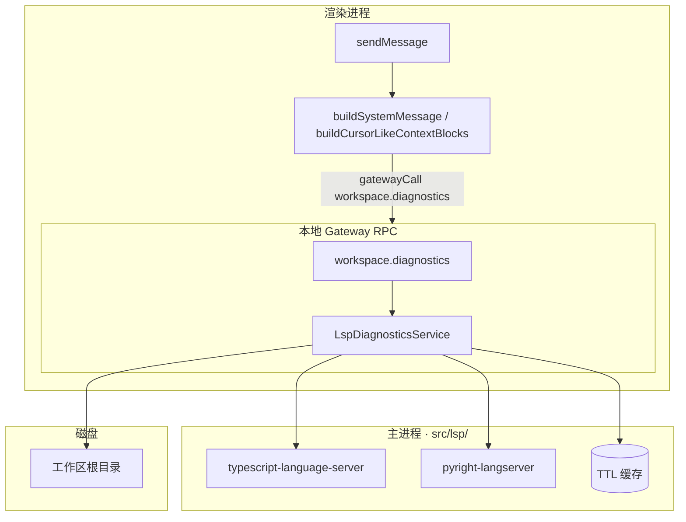

# LSP 诊断注入（无 Monaco · Agent 上下文）

> **目标**：在 Agent 发消息前，把当前工作区相关文件的 **Language Server 诊断**（错误/警告）注入 system prompt，让模型「修 bug」时像 Cursor 一样先看到报错位置。
> **边界**：本阶段 **不做 Monaco UI**；诊断仅作为 **只读上下文** 给模型，不在侧栏画波浪线。Monaco 接入时复用同一套 LSP 后端。

---

## 1. 约束与边界

| 项 | 约定 |
|----|------|
| 运行位置 | **主进程** spawn / 管理 language server；Gateway RPC 对外 |
| 渲染进程 | 只 `gatewayCall` 取诊断块，拼进 `buildSystemMessage`；改后验收用 `fetchWorkspaceVerifyDiagnostics` |
| 工作区 | **本地**：LSP + CLI 降级；**SSH**：仅远程 `tsc` CLI（无本地 LSP spawn） |
| UI | **无** Problems 面板、无 Monaco；可选设置页「启用 LSP 诊断」开关 |
| 与 Monaco 关系 | 共用 `src/lsp/` 管理器；Monaco 后期只加 `didChange` 同步与 gutter 展示 |

**不在 Phase 1**：补全、跳转、Rename、格式化、多工作区、全项目 `tsc --build` 替代 LSP。

---

## 2. 架构



### 2.1 调用时机

| 场景 | 是否拉诊断 |
|------|------------|
| Agent 模式 + 已绑定工作区 + 代码结构信号 | **是**（见 `shouldFetchWorkspaceDiagnostics` / `shouldInjectCodeContext`：`@Codebase`、消息内路径、编辑器选区、**编辑器已打开文件**等；无意图关键词门闩） |
| Plan / 长程 / 无工作区 | **否** 或受限 |
| 无代码结构信号 | **否** |

### 2.2 诊断哪些文件

按优先级合并，**最多 6 个文件**，去重：

1. 用户消息 `extractPathHintsFromText()` 提取的路径
2. `getContextFilePathsForAgent()` — 侧栏选中 + 会话最近文件
3. `getSessionChangeRowsForAgent()` — 本会话变更文件（前 3）

每个文件：读 UTF-8 文本 → LSP `textDocument/didOpen`（+ 可选 `didChange` 全量）→ 等待 `publishDiagnostics` → 关闭或保留 document 于 cache。

**不做**全工作区扫描；避免打开仓库就拉满 CPU。

---

## 3. Language Server 映射（Windows 本地）

| 扩展名 | Server | 启动命令（示例） | 备注 |
|--------|--------|------------------|------|
| `.ts` `.tsx` `.js` `.jsx` `.mjs` `.cjs` | TypeScript | `npx -y -p typescript-language-server -p typescript typescript-language-server --stdio` | 需工作区有 `tsconfig` 或单文件 inferred；`typescript` 为 peer，须与 LS 一起安装 |
| `.py` | Pyright | `npx -y -p pyright pyright-langserver --stdio` | 或工作区 `node_modules/pyright` / PATH 中的 `pyright-langserver` |
| `.json` | 不走 tsserver | `package.json` / `tsconfig*.json` 是工程配置，didOpen 会报 Unexpected resource |
| 其他 | **跳过** | — | Phase 2 可加 eslint LSP、rust-analyzer |

**探测策略**：

1. `%APPDATA%/pixel-office-agent/lsp.json` 可覆盖 command（高级用户）
2. 默认 `npx -y` 免全局安装；首次慢，可提示
3. 找不到 server → 该语言 **静默跳过**，不阻塞发消息

**工作区根**：Gateway `defaultCwd` / `getWorkspace().workspacePath`，LSP 启动时 `initialize` 带 `rootUri`。

---

## 4. Gateway RPC

### 4.1 `workspace.diagnostics`

**请求**

```json
{
  "workspaceRoot": "可选，默认当前工作区",
  "files": ["src/foo.ts", "C:\\proj\\bar.py"],
  "maxFiles": 6,
  "maxPerFile": 20,
  "minSeverity": "warning"
}
```

**响应**

```json
{
  "ok": true,
  "cached": false,
  "items": [
    {
      "file": "src/foo.ts",
      "language": "typescript",
      "server": "typescript-language-server",
      "diagnostics": [
        {
          "severity": "error",
          "line": 42,
          "col": 5,
          "message": "Type 'string' is not assignable to type 'number'.",
          "code": "TS2345",
          "source": "typescript"
        }
      ],
      "error": null
    }
  ],
  "skipped": [{ "file": "readme.md", "reason": "no_lsp" }]
}
```

### 4.2 `workspace.diagnostics_status`（可选）

返回各 language server 是否就绪、上次耗时，供设置页/调试。

---

## 5. 注入格式（Agent system prompt）

块标题固定，便于模型识别：

```text
【工作区诊断 · LSP】
工作区：D:\proj\myapp
说明：以下为语言服务静态分析结果；修 bug 时优先处理 error，勿臆造不存在的行号。

### src/renderer/renderer-example.js
- [error] L42:5 TS2345 — Type 'string' is not assignable to type 'number'.
- [warning] L88:1 — 'foo' is declared but never used.

### src/main-entry.js
（无诊断）
```

**规则**：

- 单文件最多 `maxPerFile` 条；error 优先于 warning
- 总字符上限 **~4000**（与 `CTX_LIMITS` 并列，超出截断并注明）
- 拉取超时 **8s**（`DEFAULT_TIMEOUT_MS`，可用 `lsp-settings.json` 覆盖；prep 不堵死，超时则省略本块）
- 冷启动：首次 `npx -y` 拉取 `typescript-language-server` 可能超过超时预算 → 本轮降级（省略块或回落 CLI），下次调用命中已启动的 server
- 无诊断时不注入空块

**接入点**：

- `src/renderer/renderer-context-engine.js` — `fetchWorkspaceDiagnosticsContext` / `fetchWorkspaceVerifyDiagnostics`
- `src/renderer/renderer-agent-loop.js` — `buildSystemMessage` 与完成验收注入

---

## 6. 缓存与失效

| 键 | 值 |
|----|-----|
| `workspaceRoot + filePath + mtimeMs + size` | diagnostics 数组 |

- **TTL**：30s（同文件 Agent 连发不重复 spawn）
- **失效**：`fs.write_file` 成功后 Gateway 发 `lsp:invalidate` 或由 RPC 内对比 mtime
- **进程**：每种 language **单例** server per workspace root；空闲 **5min** 无请求则 `shutdown`

---

## 7. 实现分期

### Phase 0 — 骨架（0.5 天）

- [x] `src/lsp/lsp-client.js` — JSON-RPC over stdio（initialize / didOpen / publishDiagnostics / shutdown）
- [x] `src/lsp/diagnostics-service.js` — 文件队列、缓存、超时
- [x] `src/lsp/language-registry.js` — 扩展名 → server 命令
- [x] `src/gateway/rpc.js` — `workspace.diagnostics` / `workspace.diagnostics_status`
- [x] `npm run test:lsp` — 无网络回归（纯函数 + 注入 fake client 的落点断言 + 远程 handler 唯一实现 + server 缺失快速失败）
- [x] `DIEYUN_LSP_E2E=1 node scripts/test-lsp.cjs` — 可选端到端（真起 LSP 对单文件抓诊断，需网络/npx）

### Phase 1 — 注入 Agent（0.5 天）

- [x] `fetchWorkspaceDiagnosticsContext` + 注入 Agent system；改后验收用 `fetchWorkspaceVerifyDiagnostics`
- [x] `extractPathHintsFromText` + `getContextFilePathsForAgent` 合并逻辑
- [x] 设置 → 权限：**启用 LSP 诊断**（默认 **开**）→ `%APPDATA%/pixel-office-agent/lsp-settings.json`

### Phase 2 — TS + Python 打磨（1 天）

- [x] `tsconfig` / `pyrightconfig` 根目录探测（`src/lsp/project-root.js`）
- [x] 失败降级：TS → `tsc --noEmit`；Python → `pyright --outputjson`（`src/lsp/cli-fallback.js`）
- [x] 远程 SSH 工作区：跳过本地 LSP，远程 `tsc` CLI（`diagnoseFilesRemote`）
- [x] `fs.write_file` 成功后 `invalidateCacheForPath`

### Phase 3 — Monaco 复用

- [x] 侧栏 Monaco 编辑时 `didChange` 推给同一 `LspDiagnosticsService`（`lsp.document_sync` RPC）
- [x] Problems 面板 UI 读 live diagnostics cache（`renderer-problems.js`）
- [x] 未使用 `monaco-languageclient`；Monaco 仅展示 + markers，LSP 仍走自研 stdio 客户端

---

## 8. 主要改动文件（Phase 0–1）

| 文件 | 改动 |
|------|------|
| `src/lsp/lsp-client.js` | **新建** stdio LSP 客户端 |
| `src/lsp/diagnostics-service.js` | **新建** 编排、缓存、语言路由 |
| `src/lsp/language-registry.js` | **新建** 扩展名 → server 命令 |
| `src/gateway/rpc.js` | `workspace.diagnostics` handler |
| `src/main-entry.js` | 创建单例 service，注入 Gateway ctx（可选 shutdown on quit） |
| `src/renderer/renderer-context-engine.js` | `fetchWorkspaceDiagnosticsContext` / `fetchWorkspaceVerifyDiagnostics` |
| `src/renderer/renderer-agent-loop.js` | `buildSystemMessage` 与完成验收注入 |
| `src/renderer/index.html` | 设置页 checkbox（可选） |
| `docs/DESIGN.md` | 指向本文 |

**不改动**：`renderer-artifacts.js`（仍 textarea）、Monaco、Rust core、Plan pipeline。

---

## 9. 配置示例

`%APPDATA%/pixel-office-agent/lsp-settings.json`

```json
{
  "enabled": true,
  "timeoutMs": 5000,
  "cacheTtlMs": 30000,
  "maxFiles": 6,
  "maxPerFile": 20,
  "minSeverity": "warning"
}
```

`%APPDATA%/pixel-office-agent/lsp.json`（可选覆盖 server）

```json
{
  "typescript": {
    "command": "npx",
    "args": ["-y", "-p", "typescript-language-server", "-p", "typescript", "typescript-language-server", "--stdio"]
  },
  "python": {
    "command": "npx",
    "args": ["-y", "-p", "pyright", "pyright-langserver", "--stdio"]
  }
}
```

---

## 10. 验收标准

0. `npm run test:lsp` 通过（改 `src/lsp/` 时 `npm test` 会按 CODEMAP 自动带上）。
1. 本地工作区打开含 TS 错误的文件（编辑器打开即可，有选区更佳），发送「修一下这个类型错误」→ system 块含 **LSP 行号与 TS 代码**。
2. 同一文件 30s 内第二次发送 → 命中缓存，prep 明显更快。
3. 未安装 Node/npx → 跳过 LSP，Agent 仍可正常发消息（无阻塞报错）。
4. 关闭「启用 LSP 诊断」→ 不 spawn 子进程、不注入块。
5. Agent 模式在有诊断时少 1–2 轮盲目 `read_file`。

---

## 11. 风险与对策

| 风险 | 对策 |
|------|------|
| 首次 `npx` 下载慢 | 超时 5s + 缓存；设置页说明需 Node |
| 大仓库 TS 分析慢 | 只 didOpen **指定文件**，不 open 全库 |
| 多 language server 内存 | 每 workspace 每语言单进程 + 空闲 shutdown |
| SSH 远程 | 不 spawn 本地 LSP；SSH 已连接时在远程跑 `npx typescript --noEmit`（仅 TS）；需 Shell 权限 |
| 与 Monaco 重复造轮 | **单一 DiagnosticsService**，Monaco 仅订阅 |

---

## 12. 与 Agent loop 的关系

```
用户发送
  → buildSystemMessage / buildCursorLikeContextBlocks
       ├─ fetchCodebaseContext
       ├─ buildOpenFilesContext
       └─ fetchWorkspaceDiagnosticsContext（绑定工作区时）
  → Rust agent loop 消费 richer system prompt
  → 写入后 fetchWorkspaceVerifyDiagnostics（完成验收）
```

诊断在 **prep 阶段**完成；loop 只消费已拼好的 system prompt。
