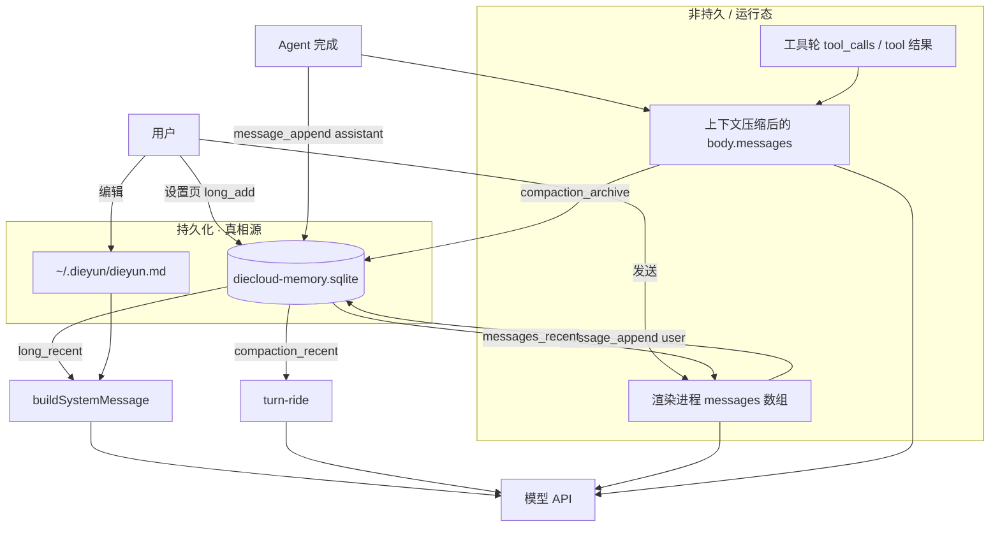
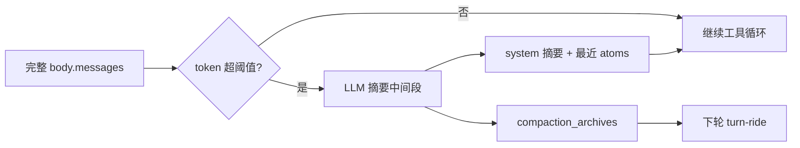

# 叠云 Agent 记忆系统设计

> 本文专门说明「记忆」在叠云里指什么、存在哪、何时读写、如何进入模型上下文。  
> 总体架构见 [DESIGN.md](./DESIGN.md)。

---

## 1. 核心结论（先读这段）

叠云**没有**单一的「万能记忆模块」，而是 **多层并行** 的记忆机制，职责不同：

| 层次 | 存储 | 生命周期 | 谁写入 | 谁读取 |
|------|------|----------|--------|--------|
| **会话消息** | SQLite `messages` | 永久（按会话） | 用户发送 / Agent 完成 | UI 历史、下轮对话上下文 |
| **上下文压缩** | 当次 `body.messages` + SQLite `compaction_archives` | 运行内替换工具链；摘要按会话持久 | 压缩 LLM | 同一次运行的后续工具轮；**下轮** turn-ride 投影最近一条摘要 |
| **长期记忆** | SQLite `long_memories` | 永久（全局） | **用户手动**（设置页） | 每轮 `buildSystemMessage` |
| **dieyun.md** | `~/.dieyun/dieyun.md` | 永久（全局） | 用户编辑文件 | 每轮 `buildSystemMessage` |
| **文件笔记目录** | `~/.dieyun/memory/` | 永久 | 用户自行维护 | **不自动注入**（预留） |
| **技能记忆** | `~/memory/` 等 | 由技能定义 | 启用对应技能后由 Agent | 技能 SKILL.md 指引 |

**重要区分：**

- **SQLite 里存的是会话账本**（user/assistant 正文）。下轮送给模型的聊天历史只从这份账本投影：近 N 条原文 + 更早折叠条，再套字符硬顶；`transientTrace` 只服务 UI，不进模型请求。弱回复（空/「已完成。」/「已停止生成。」）在落库时折成工具摘要写入正文，这样下一轮能从 content 读到，不必再刮 live trace。
- **SQLite 不是 OpenAI 多轮里的完整 `tool` 消息链**；工具过程仍嵌在 assistant 气泡元数据里供思考区展示。
- **Agent 不会自动写入 `long_memories`**；要长期记住偏好，需用户在设置里点「追加到长期记忆」，或写入 `dieyun.md` / 文件 / 技能记忆。
- **上下文压缩是有损的**：当次运行只保留摘要 + 最近 atoms；摘要写入 `compaction_archives`，下轮从该表投影进 turn-ride，不改聊天气泡。完整 tool 链仍不进 `messages` 表。

---

## 2. 总览图



---

## 3. 本地 SQLite 记忆库

### 3.1 文件位置

```
%APPDATA%/pixel-office-agent/diecloud-memory.sqlite
```

- 引擎：`better-sqlite3`，WAL 模式，外键开启。
- 实现：`crates/dieyun-core/src/memory/`（Gateway `requireRustCore`）
- 访问：渲染进程经 Gateway RPC（`memory.*`），不直接读文件。

### 3.2 表结构

#### `sessions` — 会话元数据

| 字段 | 说明 |
|------|------|
| `id` | 主键，如 `s-1712345678900` 或历史 `default` |
| `updated_at` | 最后活跃时间（毫秒） |
| `title` | 侧边栏标题；首条用户消息自动提炼（最多 48 字） |
| `archived` | 0/1，归档后不出现在默认历史列表 |
| `workspace_path` | **v1.3.68+** 该会话绑定的工作空间路径（可 null） |

当前活跃会话 ID 另存渲染进程 `localStorage`：`diecloud.active.session.v1`。

#### `messages` — 短期对话存档

| 字段 | 说明 |
|------|------|
| `id` | 自增主键 |
| `session_id` | 所属会话 |
| `role` | `user` \| `assistant` \| `system`（实际对话主要用前两者） |
| `content` | 文本；可含 `【叠云meta】{...}\n` 前缀存 UI 元数据 |
| `created_at` | 时间戳 |

**写入时机：**

1. 用户发送 → 立即 `memory.message_append`（user）。
2. Agent 正常结束 / 停止 → `memory.message_append`（assistant，含 trace 打包）。
3. 定时计划投递 → 主进程 `plans/deliver.js` 直接 `store.appendMessage`。

**读取时机：**

- 切换会话 / 启动：`memory.messages_recent`（RPC 默认 limit 50，上限 500；UI/会话服务层可显式传更大值）→ 填充渲染进程 `messages` → 重绘聊天。
- 下轮对话：`buildCompletionMessages()` 把 `messages` 里**已存储的 user/assistant 正文**拼进 API payload（不含历史轮的 tool 消息链）。

**不写入 SQLite 的内容：**

- 单次 Agent 运行中的中间 `tool` / 带 `tool_calls` 的 assistant 消息（仅在内存 `body.messages` 里流转）。
- 压缩前的完整中间 tool 链（摘要进 `compaction_archives`，原文不进 `messages` 表）。

**assistant 存档格式：**

```
【叠云meta】{"modeLabel":"Agent","modelLabel":"...",...}
<最终回复正文 + 内嵌 trace 结构>
```

UI 用 `unpackAssistantMeta()` 拆开展示模型名、思考过程等；发给模型的通常只用正文部分。

#### `long_memories` — 长期笔记式记忆

| 字段 | 说明 |
|------|------|
| `id` | 自增主键 |
| `content` | 记忆正文 |
| `source` | 来源标记，如 `user` |
| `created_at` | 时间戳 |

**写入：** 仅用户主动 — 设置 → 长期记忆 →「追加到长期记忆」（`memory.long_add`）。  
**无** Agent 自动 `long_add`、无从对话自动提炼入库。

**读取：** 每轮 `buildSystemMessage()` 调用 `memory.long_recent`（RPC 默认 limit **20**），按时间**从旧到新**排进 system：

```
【长期记忆（本地 SQLite）】
- <条目1>
- <条目2>
...
```


---

## 4. Gateway RPC 一览

| 方法 | 作用 |
|------|------|
| `memory.sessions_list` | 历史列表（仅有消息的会话） |
| `memory.session_create` | 新建会话 |
| `memory.session_get` | 会话详情含 `workspacePath` |
| `memory.session_workspace_set` | 绑定工作空间 |
| `memory.session_archive` | 归档 |
| `memory.session_delete` | 删会话及消息 |
| `memory.touch_session` | 更新 `updated_at` / 可选 title |
| `memory.message_append` | 追加消息 |
| `memory.messages_recent` | 按会话拉最近 N 条 |
| `memory.messages_clear` | 清空会话（同 delete 消息部分） |
| `memory.long_add` | 追加长期记忆 |
| `memory.long_recent` | 最近 N 条长期记忆 |

权限：记忆 RPC **不**走 `hostControl` 开关；只要 Gateway 已鉴权即可（本机信任模型）。

---

## 5. 会话内上下文：渲染进程 `messages` 与工具轮

### 5.1 两层 messages

| 变量 | 含义 |
|------|------|
| `messages`（renderer 全局数组） | 与 UI 同步的**已持久化**对话轮次 |
| `body.messages`（单次 completion） | 当次 API 请求的完整上下文，可含 system、多轮 user/assistant、tool |

发送新消息时：

```
buildSystemMessage()  →  system 块（技能、dieyun.md、长期记忆、工作空间…）
+ buildCompletionMessages()  →  历史 user/assistant 正文
+ 当前 user（含图片多模态）
→ payload.messages
→ chatCompletionWithToolsViaRust / runPlannerPipelineViaMain (Main IPC)
```

工具循环中，`body.messages` 不断增长；**只有本轮结束**才把 assistant 摘要写回 `messages` 数组和 SQLite。

### 5.2 切换会话时的记忆隔离

- 消息按 `session_id` 隔离。
- **工作空间**按 `sessions.workspace_path` 隔离（v1.3.68+）：`switchSession` → `applySessionWorkspace()` 恢复该会话目录。
- `sessionActiveRuns` 允许后台跑 Agent；完成后写入**发起时**的 `runSessionId`，不是当前正在看的会话。

---

## 6. 上下文压缩（Compaction）

控制当次 Agent 运行的上下文窗口；**摘要按会话落库**，供下一轮投影，不改聊天气泡。

| 项目 | 说明 |
|------|------|
| 实现 | Main `compaction-main.js` → Rust `compaction.maybe_compact`（Renderer 经 IPC，无本地 LLM） |
| 预算 | `窗口 − maxOutputTokens − contextReserveTokens`；**工具 schema 超出预留的部分再从这里扣**（封顶 25%），因为 tools 占窗口却不进 messages |
| 触发 | 估算 token ≥ 预算 × `triggerRatio`（默认档 0.85）；工具轮中 `messages.length > 24` 或字符数超半也会尝试，再由 Rust 侧 token 阈值与冷却裁决 |
| 策略 | 消息**原子分组**（`assistant.tool_calls` + 对应 `tool` 不拆散）；保留最近若干 atom；中间段用 LLM 摘要。摘要提示与折叠集合同源，不会出现「被折叠却未摘要」的段落 |
| 冷却 | `coolDownRounds`（默认 6）；压缩成功后轮次计数置 1（不是 0），否则下一轮冷却不成立会连续复压；`force` 可穿透冷却（上下文溢出兜底） |
| 落库 | `memory.compaction_archive` → `compaction_archives`；下轮 `memory.compaction_recent` 投影进 turn-ride |
| 累计摘要 | Main 内存 `cumulativeSummary`；进程重启后从最近一条 archive 补水 |
| 续跑 / 验收重试 | 从发送时快照的账本前缀 + 本轮工具尾巴重投影；丢掉内存里压过的中间历史（摘要走 turn-ride） |
| 用户感知 | Toast：「上下文已压缩」 |



**设计含义：**

- 长跑任务靠压缩续命，**早期 tool 细节会丢**；摘要可在之后的用户轮次被模型看到。
- 需要长期保留的信息 → `long_memories`、`dieyun.md`、或写到工作空间文件。
- Planner / Worker 子上下文压缩在 Main `compaction-main.js`（Rust loop 每轮 LLM 前）。定时计划压缩同样归档到该会话。

---

## 7. 全局指令与文件型记忆

### 7.1 `dieyun.md`（强推荐）

- 路径：`~/.dieyun/dieyun.md`（首次启动由 `agent-home.js` 创建模板）。
- 读取：`api.getDieyunMd()` → 每轮 system 注入 `【全局持久指令 · dieyun.md】`。
- 用途：项目级准则、口吻、禁忌 — **优先级高于普通长期记忆条目**。
- 与 SQLite 无关，用户直接编辑文件即可。

### 7.2 `~/.dieyun/memory/`

- 在 `agent-home.js` 中初始化 README，说明可放 Markdown 笔记。
- **当前产品未实现**自动扫描注入；与 SQLite `long_memories` 并行存在，靠用户自觉或未来功能。

### 7.3 技能自带记忆（与内置分离）

预装技能如 `memory-1.0.2`、`self-improving` 等，在 `~/.dieyun/skills` 或用户目录下维护 **另一套** 文件记忆（`~/memory/`、`~/self-improving/memory.md`）。

设计原则（技能文档原文精神）：

- **不与**内置 `long_memories` 混用；
- 由技能 SKILL.md 教 Agent 何时读写在何路径；
- 启用技能后通过 system 里的技能正文间接影响行为。

## 9. 注入 system 的完整顺序（`buildSystemMessage`）

每轮用户发送前构建，大致顺序：

1. 系统时间块  
2. 工具与编排说明（固定文案）  
3. **已启用技能**（`fetchSkillsBlock`）  
4. **`dieyun.md`**（若存在）  
5. 技能目录 / 计划任务说明  
6. **当前工作空间**路径  
7. 本机权限能力说明  
8. SQL 库表上下文（若启用）  
9. **长期记忆** — `long_recent` 20 条（RPC 默认）  

然后与 **会话 `messages` 历史** 合并送入模型。

**不在 system 里自动出现的：**

- 其他会话的消息  
- 未启用技能的记忆文件  
- `~/.dieyun/memory/` 下笔记  
- 已压缩掉的完整 tool 原文（只有 archive 摘要进 turn-ride） 

---

## 10. 定时计划与记忆的关系

定时任务主流路径是 **工具循环**（`plans/plan-agent-runner.js`），core 不可用时降级为单次 LLM（`plans/runner.js`）；两条路径都不写 `long_memories`。

会话轮次由 `plans/plan-run-turn.js` 在运行边界写入 **计划专用会话**（同 `deliver.sessionId`）的 `messages`：
**运行开始（`run_start` 之前）** 写 user 轮次，**终态事件之前** 写 assistant 轮次（含 `traceRunId`）：

```
[user]  [计划 · 名称] 时间 · 定时触发
[assistant] 执行摘要或错误（meta.traceRunId 挂回思考区）
```

因此计划产出是 **会话短期记忆** 的一部分，不是独立记忆层。

---

## 11. 设计原则与取舍

| 原则 | 说明 |
|------|------|
| **本地优先** | SQLite 是单机真相源 |
| **会话隔离** | 消息、工作空间按 session 分 |
| **短期 vs 长期分开** | 对话自动存档 ≠ 自动长期记忆 |
| **长期记忆用户可控** | 避免 Agent 乱写污染 `long_memories` |
| **工具链不整库持久化** | 省空间、省 token；trace 嵌 assistant 供 UI |
| **压缩可牺牲细节** | 用 LLM 换上下文空间，必须接受有损 |
| **全局准则走 dieyun.md** | 文件编辑比设置页 textarea 更适合长文规范 |

---

## 12. 常见误区

| 误区 | 事实 |
|------|------|
| 「换历史对话，模型还记得上次工具读了哪个文件」 | 历史轮只存 user/assistant 正文；中间 tool 链未入库，仅靠 assistant trace 或压缩前当轮内存 |
| 「说了请记住，就会自动进长期记忆」 | 不会；需手动 long_add 或写 dieyun.md / 文件 |
| 「压缩后的摘要以后还能从库里捞出来」 | 能。`compaction_archives` 按会话保存；下轮 turn-ride 注入最近一条。完整 tool 原文仍不在库里 |
| 「技能 memory 技能 = 内置长期记忆」 | 两套系统，路径与触发方式不同 |
| 「Master 和 Slave 共用同一份 long_memories」 | Slave 上传 raw；Master 读 consolidated |

---

## 13. 扩展记忆能力时改哪里

| 目标 | 建议触点 |
|------|----------|
| 新持久字段 | Rust `memory/schema.rs` 迁移 + `rpc.js` + 可选 UI |
| 自动从对话提炼长期记忆 | `sendMessage` 结束钩子或新 RPC；需防 spam |
| 扫描 `~/.dieyun/memory/` 注入 | `buildSystemMessage` 增块 + 文件 watcher |
| 按会话长期记忆 | 需 `long_memories.session_id` 或新表（当前长期记忆是**全局**的） |
| 工具链持久化 | 新表存 tool 消息或扩 `messages.content`；注意 token 与体积 |

---

## 14. 相关源码索引

```
crates/dieyun-core/src/memory/   # SQLite MemoryStore（唯一写入）
src/gateway/rpc.js               # memory.* RPC → requireRustCore
src/gateway/server.js            # Gateway 生命周期
src/agent/compaction-main.js     # IPC compaction → Rust
src/compaction-prompts.js        # 压缩 prompt（Main → Rust）
src/renderer/renderer-agent-api.js  # applyContextCompaction / estimateMessagesTokensViaMain
src/renderer/renderer.js         # messages 数组、buildSystemMessage、sendMessage、long_add UI
src/agent-home.js                # ~/.dieyun 目录与 dieyun.md
src/plans/deliver.js             # 计划结果写入会话
```

---

## 15. 文档关系

| 文档 | 内容 |
|------|------|
| **MEMORY.md**（本文） | 记忆分层、读写时机、注入规则 |
| [DESIGN.md](./DESIGN.md) | 全架构；第 5、6 节为记忆与压缩摘要 |
| [DEVELOPMENT.md](./DEVELOPMENT.md) | 开发与发版；部分历史描述可能过时，以本文与代码为准 |

---

*对齐版本：**v1.3.68**（会话 `workspace_path`、产物面板）。记忆相关行为变更时请同步更新第 3、8、11 节。*
